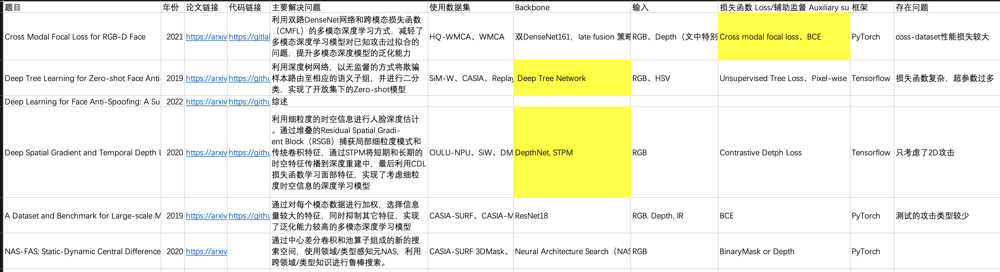
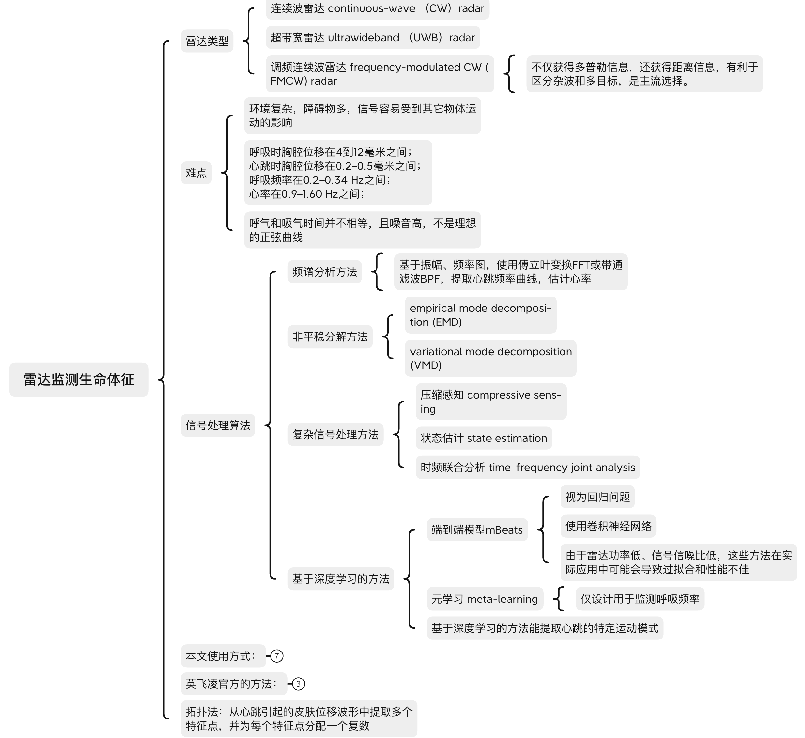
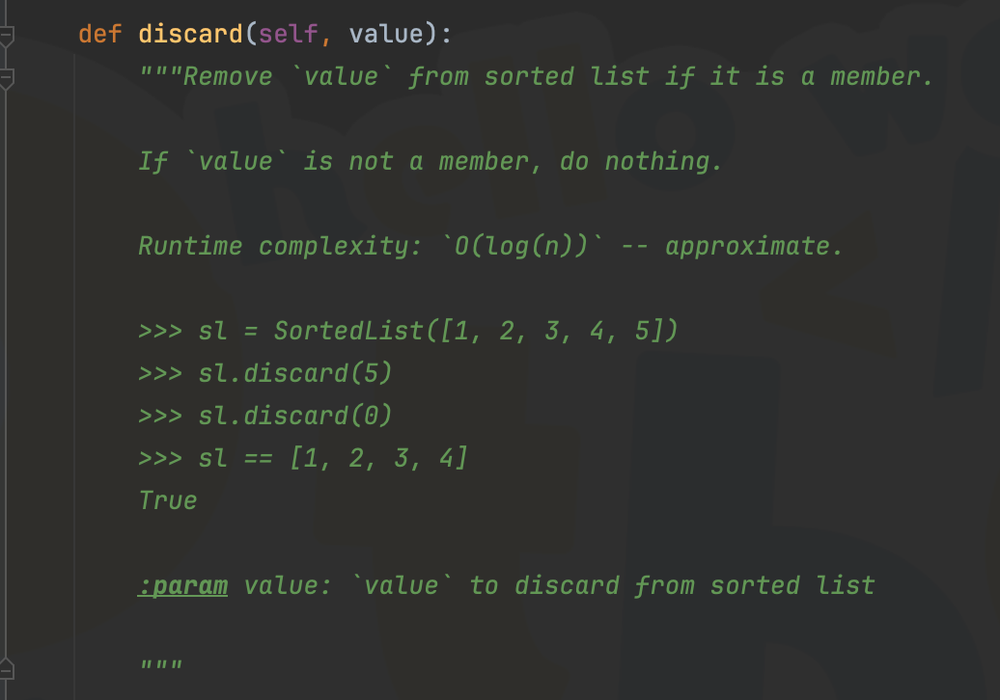
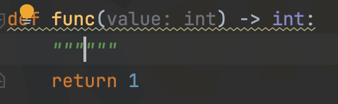
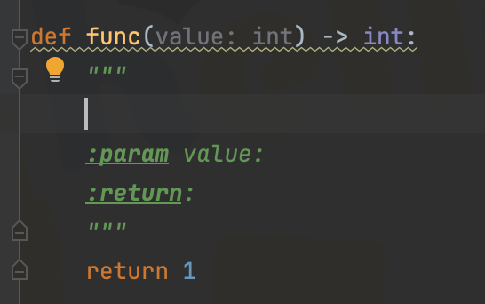

[TOC]

# 资料整理方法【经验分享】

当资料积累到一定程度，我们往往会对海量信息感到无所适从。为了改善工作体验，我们需要一种规范且有序的资料整理方法。

## 文献整理

当我们阅读的文献到达一定数量时，就需要对他们进行整理分类，以提高我们检索效率。**好的文章**值得反复阅读，随着你对该研究方向知识的积累，每次阅读都会有新的理解。

### 常用文件结构

以毫米波雷达方向为例，可以按照综述、通用算法、应用的方式分类。通用算法类为一些信号分解算法、参数优化算法等文章。应用类为使用毫米波雷达做生命体征监测、步态识别等具体应用的文章。当你的文章多到一定程度还可以对它们进一步分类。

```bash
根文件
.
├── 研究方向 1
│   ├── 综述类文献
│        └── 。。。
│   ├── 通用算法类文献
│        └── 。。。
│   └── 应用类文献
│        └── 。。。
│       
├── 研究方向 2
│       
│       
```

### 使用表格整理文章

为了迅速定位已存档论文中的目标论文，我们建议采用表格形式整理文献资料。表格应包含以下关键要素作为表头：**论文标题**、**发表年份**、**原文链接**、**代码链接**（如有）、**摘要**、**使用的数据集**、**主要创新点**以及**代码框架概述**等。通过这种方式，你可以根据不同的特征对论文进行分类和检索，从而提高查找效率。



### 善于使用思维导图、流程图等可视化工具

思维导图推荐软件：Xmind

流程图推荐软件：draw.io、PPT、visio

数据可视化软件：Matlab、Origin

通过图形化的方式组织信息和概念，可以帮助你更好地理解和记忆，数据可视化方法可以自由发挥，下图是一个例子。



## 代码整理

在收集和编写代码的过程中，整理可重用的自定义功能函数至关重要。为这些函数编写详尽的注释，并将其妥善保存在代码托管平台上（如Github、Gitee），不仅能提高代码的可读性和可维护性，还能在将来的项目中大幅节省开发时间。

### 勤写 `README.md` 文件

`README.md` 文件应包含对整个项目代码的功能介绍，以及如何快速启动本项目。

### 函数注释

一段优秀的代码少不了详细规范的注释。下图为Python `sortedcontainers`库 `SortedList` 中 `discard` 函数注释范例，类似的注释可以在Python库中找到很多，因此我们需要养成对自定义函数规范注释的习惯。



衡量一个注释是否详细的标准为：“当你基本忘记这段代码，再来看时仍然可以快速调用”。

下例为信号处理算法——静杂波滤除自定义算法的工程实例。可以看到，这里对函数参数进行了变量类型限制，如`fft_data` 为`np.ndarray`类型的变量。Python 不强制对变量规定类型，但在实际编写函数时为了防止不必要的错误（如`int`类型的输入，被用成了 `float` 导致小数求余不精确的问题）常常需要对函数参数进行规定变量类型。

```python
def MTI(fft_data: np.ndarray, axis: int = 1) -> np.ndarray:
    """
    静态杂波滤除:MTI(Moving Targets Indication 动目标显示)
    :param fft_data: 原始数据
    :param axis: 操作对象是行还是列，1 表示对每行进行denoise，否则为列[是否一行为一个chirp。1表示一行代表一个chirp，0表示一列代表一个chirp]
    :return: 返回降噪后的数据
    """
    fft_data_denoise = fft_data.copy()  # 深拷贝数组，否则传递的是指针
    if axis == 1:
        chirps_num = fft_data_denoise.shape[0]
        for i in range(chirps_num - 1):
            # 滑动相消
            fft_data_denoise[i, ::] = fft_data_denoise[i + 1, :] - fft_data_denoise[i, :]
        # 由于最后一个chirp没计算，故丢弃
        fft_data_denoise[chirps_num - 1, ::] = fft_data_denoise[chirps_num - 2, :]
    else:
        chirps_num = fft_data_denoise.shape[1]
        for i in range(chirps_num - 1):
            # 滑动相消
            fft_data_denoise[::, i] = fft_data_denoise[:, i + 1] - fft_data_denoise[:, i]
        # 由于最后一个chirp没计算，故丢弃
        fft_data_denoise[::, chirps_num - 1] = fft_data_denoise[:, chirps_num - 2]
    return fft_data_denoise
```

Pycharm 中给出了一个便捷的注释方式：直接在自定义函数下打两个 `引号` ，IDE 会生成 6 个引号，此时直接回车，会给出注释模版，如下图所示。





## 注意点

- ==本文为个人平时习惯的总结，存在一定疏漏，希望后续读者继续补充。==

- ==资料整理方法一定要按照实际需求来，它的目的是减少我们回顾之前的信息时所花费的检索、理解时间。==